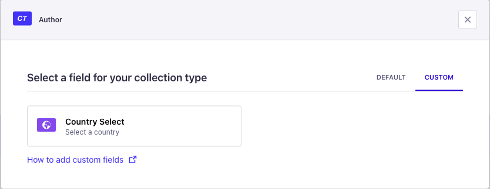
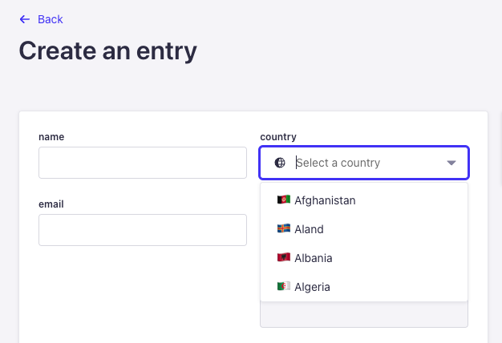

<p align="center">
     
</p>

<h1 align="center">
  Strapi Country Select
</h1>

<p align="center">Custom Field plugin for Strapi to select countries in ISO 3166-1 alpha-2 format</p>

<p align="center">
  <a href="https://www.npmjs.com/package/strapi-country-select">
    
    
  </a>
</p>

The Strapi Country Select Plugin is a custom plugin for Strapi that allows you to to select countries in `ISO 3166-1 alpha-2` format.

## ⚙️ Installation

To install the Strapi Advanced UUID Plugin, simply run one of the following command:

```
npm install strapi-country-select
```

```
yarn add strapi-country-select
```

## ⚡️ Usage

### How to Setup Country Select Field

After installation you will find the `Country Select` at the custom fields section of the content-type builder.



Now You can create new records via the Admin panel, API or GraphQL.



## 👍 Contribute

If you want to say **Thank You** and/or support the active development of `Strapi Country Select`:

1. Add a [GitHub Star](https://github.com/Dulajdeshan/strapi-country-select/stargazers) to the project.
2. Support the project by donating a [cup of coffee](https://buymeacoff.ee/dulajdeshan).

## 🧾 License

This plugin is licensed under the MIT License. See the [LICENSE](./LICENSE.md) file for more information.
